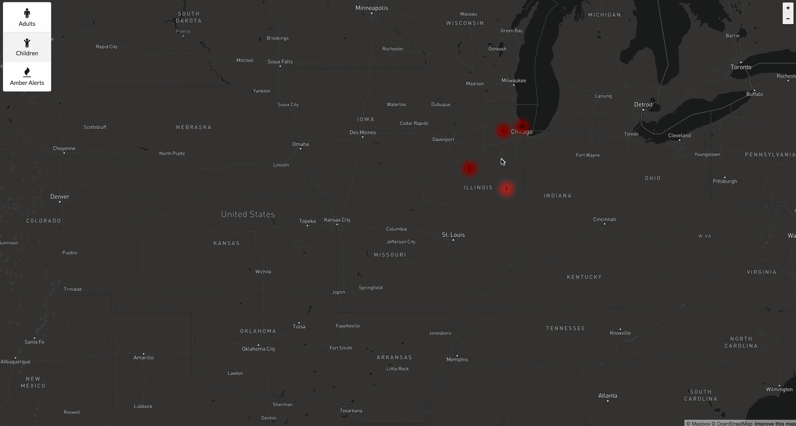

# Missing
A Web application to track missing people and visualize insights

# Startup

```
npm i
npm start
# visit localhost:3000
```

# resources

`http://www.missingkids.com/`

`http://www.namus.gov`

# walkthrough


